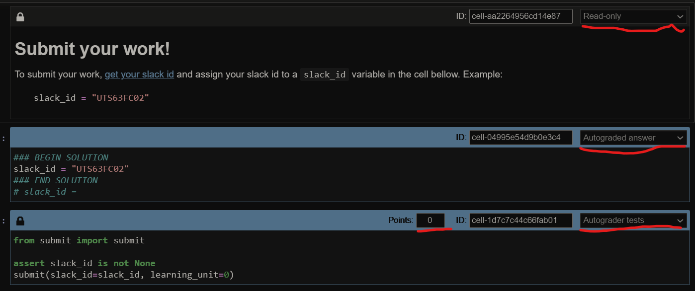

# For Instructors

## use Jupyter notebook

1. Copy the `submit.py` file to the same folder as the Exercise Notebook.
2. Install the requirements on this repo

```bash
cd nb-grades-collector
pip install -r requirements.txt
```

3. Update the requirements of the LU you're working on

```bash
cd Week\ 00/SLU00\ -\ Jupyter\ Notebook/
pip freeze > requirements.txt
```

4. To enable students to submit a LU you'll need to add 3 cells at the bottom of the notebook, as follows (dont forget to set the learning unit number!):



**Cell 1** markdown, read-only
```markdown
# Submit your work!

To submit your work, [get your slack id](https://moshfeu.medium.com/how-to-find-my-member-id-in-slack-workspace-d4bba942e38c) and fill it in the `slack_id` variable.

Example: `slack_id = "UTS63FC02"`
```

**Cell 2** code, Autograded Answer
```python
slack_id = None
```

**Cell 3** code, Autograded tests (dont forget to set the learning unit number!)
```python
from submit import submit

assert slack_id is not None
submit(slack_id=slack_id, learning_unit=0)
```

This serves to collect the student slack ids so that we know who has submitted the LU.

# For Maintainers

## use with curl

```bash
curl --header "Content-Type: application/json" \
  --request PUT \
  --data '{"learning_unit": 0,"slack_id":"UTS63FC02","grade": 0,"metadata":{}}' \
  http://localhost:8000/submit

curl --header "Content-Type: application/json" \
  --request PUT \
  --data '{"learning_unit": 0,"slack_id":"UTS63FC02","grade": 0,"metadata":{}}' \
  http://localhost/submit

curl --header "Content-Type: application/json" \
  --request PUT \
  --data '{"learning_unit": 0,"slack_id":"UTS63FC02","grade": 0,"metadata":{}}' \
  https://sub-nb-grades-collector.herokuapp.com/submit
```

## gvnicorn local run

```bash
uvicorn main:app --reload
```

## docker local run

```bash
docker build -t nb-grades-collector .
docker run --rm -it -p 80:80 nb-grades-collector
```

## deployment

```bash
heroku stack:set heroku-20
heroku git:remote -a sub-nb-grades-collector
git push heroku <branch>:main
```

## docs

```bash
https://sub-nb-grades-collector.herokuapp.com/docs
```

## postgres connect

```bash
heroku pg:psql
```
